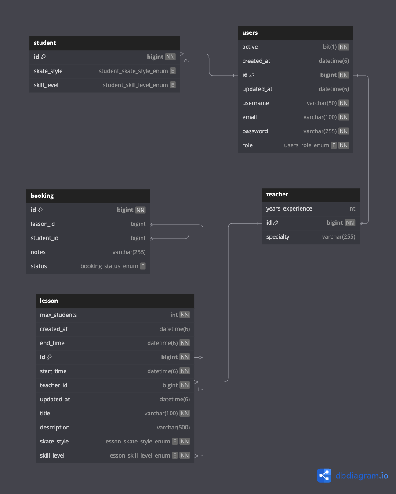
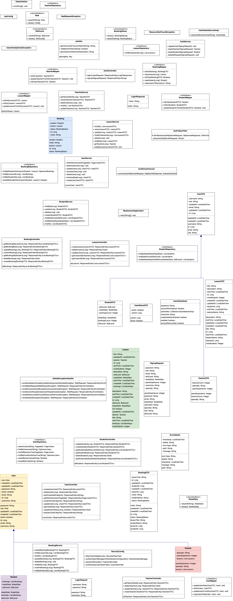

# Skate School Booking Management System :)

## Project Description
Skate School is a management application developer for all skateboarding school to help them with organizing their bookings.
It allows for the management of students, teachers, lessons, and bookings.
The application offer CRUD functionality for all main entities and implements a secure authentication system.

## Class Diagram
 - Detailled version created with dbdiagram.io
 - Complete diagram created with draw.io

## Configuration
1. Clone the repository
2. Ensure you have Java 21 and Maven installed
3. Set up the following environment variables:
    - `DB_USERNAME`: Your MySQL database username
    - `DB_PASSWORD`: Your MySQL database password
    - `JWT_SECRET`: A secret key for JWT token generation
4. Configure your MySQL database in the `application.properties` file
5. Run `mvn clean install` to install dependencies
6. Start the application with `mvn spring-boot:run`

## Environment Variables
The application uses the following environment variables:
- `DB_USERNAME`: Database username
- `DB_PASSWORD`: Database password
- `JWT_SECRET`: Secret key for JWT token generation

Make sure to set these variables in your environment or use a `.env` file before running the application.

## Technologies Used
- Java 21
- Spring Boot 3.2.3 (stable version)
- Spring Data JPA
- Spring Security
- MySQL 8.2.0
- Lombok 1.18.30
- MapStruct 1.5.5.Final
- JWT 0.12.5 for authentication
- Flyway 9.22.3 for database migrations 
- (Flyway is currently disabled, was not requested but i've implemented it for learning purposes.)

## Controller Structure and Endpoints

### AuthController
- POST /api/auth/signup : Register a new user
- POST /api/auth/signin : User login

### StudentController
- GET /api/students : Retrieve all students
- GET /api/students/{id} : Retrieve a specific student
- POST /api/students : Create a new student
- PUT /api/students/{id} : Update an existing student
- DELETE /api/students/{id} : Delete a student

### TeacherController
- GET /api/teachers : Retrieve all teachers
- GET /api/teachers/{id} : Retrieve a specific teacher
- POST /api/teachers : Create a new teacher
- PUT /api/teachers/{id} : Update an existing teacher
- DELETE /api/teachers/{id} : Delete a teacher

### LessonController
- GET /api/lessons : Retrieve all lessons
- GET /api/lessons/{id} : Retrieve a specific lesson
- POST /api/lessons : Create a new lesson
- PUT /api/lessons/{id} : Update an existing lesson
- DELETE /api/lessons/{id} : Delete a lesson

### BookingController
- GET /api/bookings : Retrieve all bookings
- GET /api/bookings/{id} : Retrieve a specific booking
- POST /api/bookings : Create a new booking
- PUT /api/bookings/{id} : Update an existing booking
- DELETE /api/bookings/{id} : Delete a booking

## Database Configuration
The application uses MySQL as its database. The connection details are configured in the `application.properties` file. Make sure to set up your MySQL database and update the connection URL if necessary.

## Security
The application uses JWT for authentication. Make sure to keep your JWT secret key secure and do not expose it in your code or version control system.

## Flyway Migration
Flyway is configured in the application but is currently disabled. If you wish to enable it for database migrations, set `spring.flyway.enabled=true` in the `application.properties` file.
